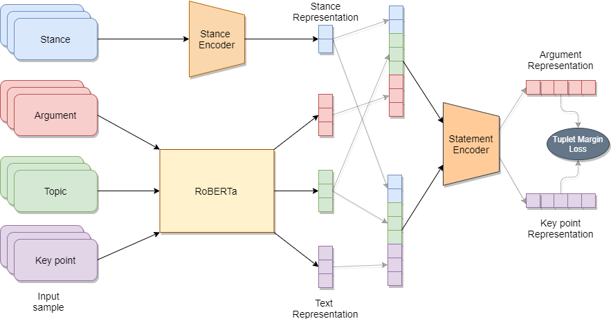

# 🏅Quantitative Summarization – Key Point Analysis🏅

## TODO:

### Pair-wise keypoint-argument
Given a pair of key point and argument (along with their supported topic & stance) and their matching score. Similar pairs with label 1 are pulled together, or pushed away otherwise.

#### Model

| Model               | BERT/ConvBERT               | DistilBERT         | ALBERT             | XLNet            | RoBERTa                | ELECTRA            | BART            |
| ------------------------------ | ------------------ | ------------------ | ------------------ | ------------------ | ------------------ | ------------------ | ------------------ |
| Siamese Baseline            | ✔️ | ✔️ | ✔️ | ✔️ | ✔️ | ✔️ | ✔️ |
| Siamese Question Answering-like              | ✔️ | ✔️ | ✔️ |  | ✔️ | ✔️ | ✔️ |
| Custom loss Baseline             | ✔️ | ✔️ | ✔️ | ✔️ | ✔️ | ✔️ | ✔️ |

#### Loss

- [x] Constrastive
- [x] Online Constrastive
- [x] Triplet
- [x] Online Triplet (Hard negative/positive mining)

#### Distance

- [x] Euclidean
- [x] Cosine
- [x] Manhattan

### Pseudo-label

Group the arguments by their key point and consider the order of that key point within the topic as their labels (see [pseudo_label](src/pseudo_label)). For now we can used available pytorch metrics learning losses, miners or reducers from this great [open-source](https://github.com/KevinMusgrave/pytorch-metric-learning) in the main training workflow.

### Utils

- [x] K-folds
- [x] Full-flow

## Acknowledgements

The implemented [losses](src/losses) are adapted from [sentence-transformers](https://github.com/UKPLab/sentence-transformers)